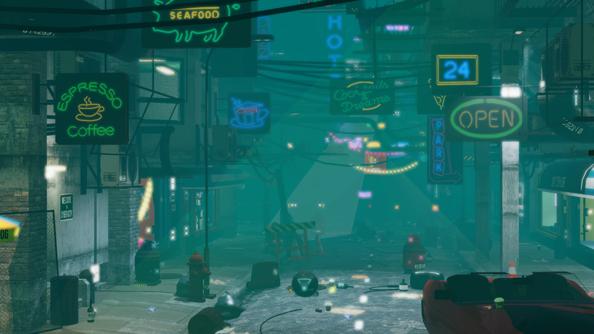

# Cyberpunk City Demo

A real-time rendering demo showcasing ray tracing and volumetric lighting effects in a cyberpunk city environment.



## Features

- **Ray-traced reflections \[Vlad\]** using Vulkan RTX
- **Ray-traced shadows \[Vlad\]** using Vulkan RTX
- **PBR materials and Lighting \[Vlad\]** with emissive neon lighting
- **Bloom and Distance Fog Effects \[Vlad\]** in a multipipeline/multipass setup
- **Real-time vehicle movement \[Tasos\]** on predefined paths
- **Post-processing pipeline \[Tasos\]** containing bloom and tone mapping
- **Transparency Support \[Tasos\]** using additional rendering passes
- **MSAA or Temporal Anti-Aliasing (TAA) \[Tasos\]** for smooth edge rendering and reduced flickering

## **Controls**

### **Free Camera Mode  \[Tasos\]**
Toggle between Cinematic and Free Camera modes by pressing **`F`**.

| Key | Action |
|-----|--------|
| `W`, `A`, `S`, `D` | Move Camera (Forward, Left, Backward, Right) |
| `Space` | Move Up |
| `Left Ctrl` | Move Down |
| `Left Shift` | Sprint (Move Faster) |
| `Mouse` | Look Around |

## Hybrid Rendering Architecture

This project uses a **hybrid rasterization + ray tracing** approach for optimal real-time performance:

- **Rasterization \[Tasos\]**: Traditional graphics pipeline renders the base scene geometry (vertex + fragment shaders)
- **Inline Ray Queries  \[Vlad\]**: Fragment shader selectively shoots rays using `TraceRayInline()` for specific effects
- **Ray-Traced Shadows \[Vlad\]**: Shadow rays test occlusion from directional, point, and spot lights
- **Ray-Traced Reflections \[Vlad\]**: Reflection rays only traced for smooth/metallic surfaces (roughness < 0.3)
- **Acceleration Structures \[Vlad\]**: BLAS/TLAS enable fast ray-geometry intersection tests (~2-6 rays per pixel)

### What Ray Tracing Actually Computes

**Ray Traced (Hardware Accelerated):**
- **Shadows**: Shadow rays from surface to each light source to test occlusion (1 ray per light: directional + point lights + spot lights in range)
- **Specular Reflections**: Reflection rays for smooth/metallic materials only (1 ray/pixel when applicable)

**NOT Ray Traced (Optimized Alternatives):**
- **Base Geometry**: Rendered via traditional rasterization (much faster than ray tracing every pixel)
- **Diffuse Lighting**: Calculated using PBR equations in fragment shader (no rays needed)
- **Ambient Occlusion**: Pre-baked into textures during asset creation (loaded from GLTF models)
- **Indirect Diffuse**: Approximated by sampling skybox texture based on surface normal

## Multisample Anti-Aliasing (MSAA)

The project supports MSAA as an alternative to TAA, automatically selecting the highest available sample count (up to 64x) based on GPU capabilities:

- **Automatic Sample Count**: Queries the GPU for supported framebuffer sample counts and selects the maximum available
- **Multisampled Render Targets**: Color and depth attachments are created with the selected sample count
- **Resolve Pass**: Multisampled images are resolved to single-sample images before post-processing
- **Toggle via Constant**: Set `TAA_ENABLED = false` in `constants.hpp` to use MSAA instead of TAA

MSAA effectively smooths geometric edges but does not address shader aliasing (specular highlights, thin geometry). For scenes with complex lighting, TAA is recommended.

## Temporal Anti-Aliasing (TAA)

The project implements TAA as the primary anti-aliasing solution, replacing traditional MSAA:

- **Sub-pixel Jittering**: Camera projection is jittered each frame using a Halton(2,3) sequence
- **Motion Vectors**: Per-pixel velocity buffer tracks screen-space movement for accurate reprojection
- **History Blending**: Current frame blended with reprojected history (90% history, 10% current)
- **Neighborhood Clamping**: YCoCg color space clamping prevents ghosting artifacts on fast-moving objects

TAA provides superior anti-aliasing quality compared to MSAA while using less memory and handling shader aliasing (specular highlights, thin geometry) that MSAA cannot address.

## Performance Optimizations

The project implements several key optimizations for real-time performance:

- **Persistent Mapping**: GPU buffers mapped once at initialization and kept mapped throughout the application lifetime, eliminating map/unmap overhead on every frame
- **Selective Updates**: Only animated objects, lights, and dynamic data are updated each frame - static geometry remains untouched
- **Frames in Flight**: Separate buffer copies per frame-in-flight prevent CPU/GPU synchronization stalls (triple buffering for uniform/instance/light buffers)
- **Early Exits**: TLAS rebuilds and buffer updates skip work entirely when no animated objects have moved
- **Instance Masks**: Per-object ray visibility masks (0x01 = reflective, 0x02 = shadow-casting) allow fine-grained control over which rays hit which geometry
- **Frustum Culling**: CPU-side frustum culling eliminates draw calls for objects outside the camera view before GPU submission
- **Indirect Drawing**: Multi-draw indirect commands batch multiple draw calls into a single GPU submission with minimal CPU overhead
- **TAA or MSAA**: Temporal Anti-Aliasing replaces MSAA for better quality anti-aliasing with lower memory overhead (when enabled)
- **Adaptive Texture Quality**: Automatic texture resolution scaling based on available VRAM (512px-8K)

## External Resources

* Soundtracks: 
  * [Cosmic Countdown](https://www.epidemicsound.com/music/tracks/2e5598c9-de18-4c94-a830-b7ef7b7a09fc/) by [Ben Elson](https://www.epidemicsound.com/artists/ben-elson/)
  * [Wanderlust](https://www.epidemicsound.com/music/tracks/a8a07c28-92f0-45db-8332-51b8d876218d/) by [Ben Elson](https://www.epidemicsound.com/artists/ben-elson/)
* Models: [Cyber City](https://assetstore.unity.com/packages/3d/environments/sci-fi/cyberpunk-cyber-city-urp-267305) by [IL.ranch](https://assetstore.unity.com/publishers/11203)

## Development

### Requirements

- Windows 10/11 with latest updates
- Any C++ IDE, preferably supporting CMake Projects, such as CLion, VS Code, or Visual Studio
- Vulkan SDK 1.4+ (slangc must be on PATH)
- NVIDIA RTX 3070 (or better) with updated drivers
- CMake 3.20+

### Quick Start

**1. Clone the repo**

```powershell
git clone https://github.com/akarampekios/cg25-group25.git
```

**2. Download the scene resources**

1. Download resources: https://drive.google.com/drive/folders/1xk8Wu9cH5RofmuqMPcwWDUX4sHjm585d?usp=sharing
2. Unpack the resources to resources/models, resources/scenes, and assets/

**3. Build & Run**

```powershell
cd CyberpunkCityDemo
git submodule update --init --recursive
.\build.bat
```

The compiled binary lives at `build/bin/Release/CyberpunkCityDemo.exe`. Assets and shaders are copied automatically when you build.

To launch a simplified test scene, adjust the `Application.cpp` to point to the `scene_test.glb`.

## Running

Launch from Explorer or the terminal (cw must be the binary folder):

```powershell
build\bin\Debug\CyberpunkCityDemo.exe
build\bin\Release\CyberpunkCityDemo.exe
```

You should see debug output in the console while the renderer runs.

## Next Steps

Please consult the [Wiki](https://github.com/akarampekios/cg25-group25/wiki) for more information.
